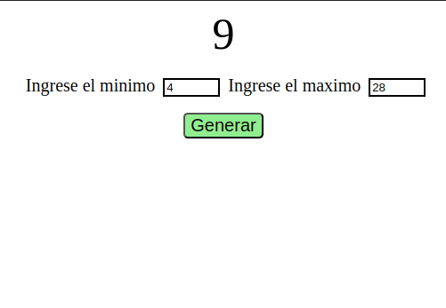

# Generador de Números Aleatorios

Este proyecto es un generador de números aleatorios que permite al usuario especificar un rango mínimo y máximo para generar un número aleatorio dentro de ese intervalo.

## Funcionalidades

El generador de números aleatorios ofrece las siguientes funcionalidades:

- **Especificación de Rango:** Permite al usuario ingresar un valor mínimo y máximo para limitar el rango en el cual se generará el número aleatorio.
- **Generación de Número Aleatorio:** Una vez especificado el rango, el generador produce un número aleatorio dentro de ese intervalo.

## Tecnologías Utilizadas

El proyecto está desarrollado utilizando las siguientes tecnologías:

- **HTML:** Para la estructura básica de la interfaz de usuario.
- **CSS:** Estilos para mejorar la apariencia y usabilidad de la interfaz.
- **JavaScript:** Implementación de la lógica para generar números aleatorios y manejar la interacción del usuario.

## Uso

Para utilizar el generador de números aleatorios, simplemente abre el archivo `index.html` en tu navegador web y sigue las instrucciones en pantalla para ingresar el rango mínimo y máximo deseado. Luego, haz clic en un botón para generar el número aleatorio correspondiente.
